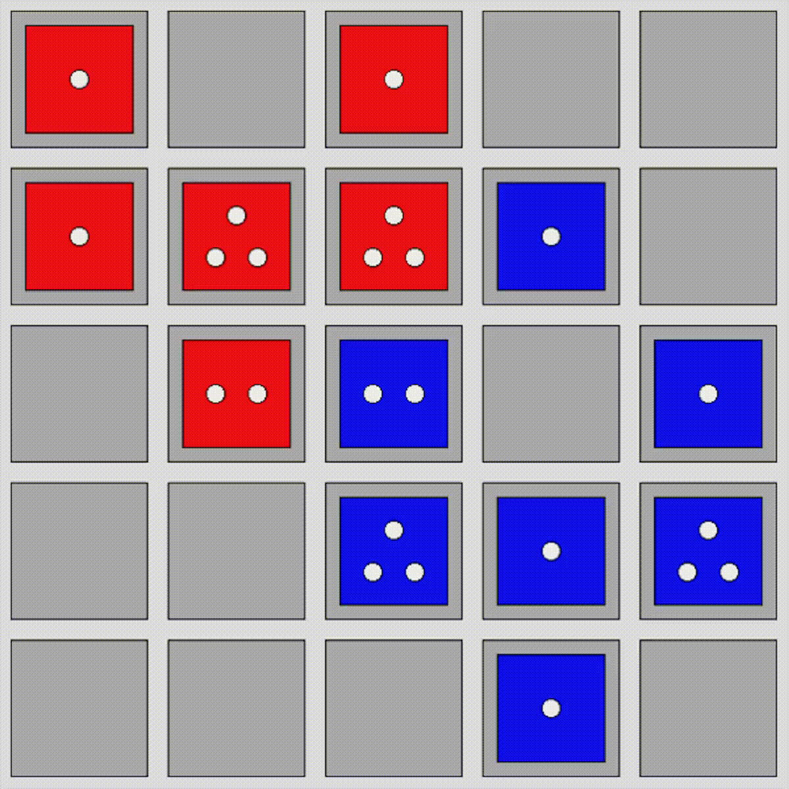
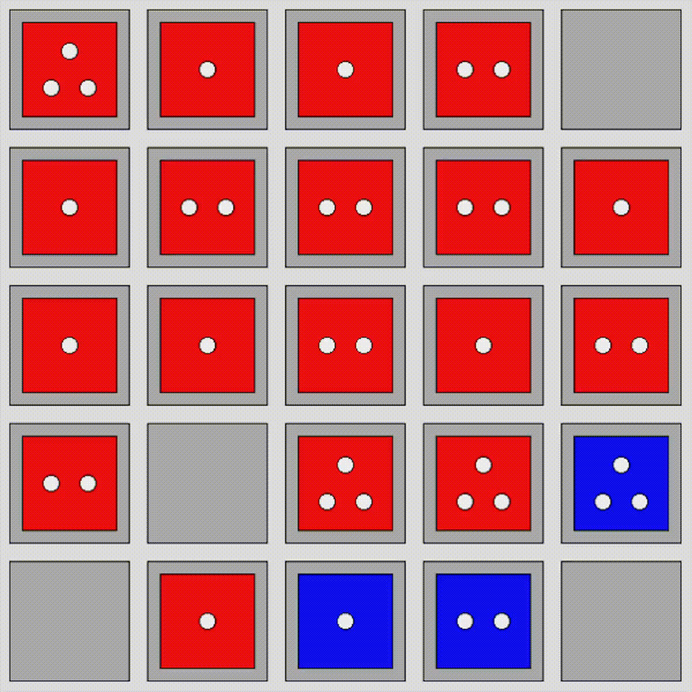

# Clonium
Rules:
- Each player has it's own cells
- Every turn he can increase number of dots on cell
- If there is 4 dots on the cell, then it's spreads in all four sides and also *captures opponent cells*

The goal is to capture every other player's cells

----

## How to setup
### Run: `python3 main.py`
All you need is `python3`; 
Game uses built-in `tkinter`

Tested on `Python 3.10.5 TkVersion 8.6`
